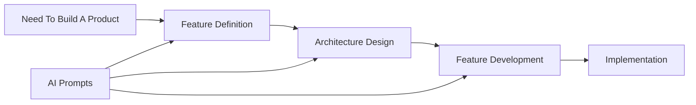

# 🏗️ SpecForge

**The First-Principles Software Engineering Framework**

Build software systematically, not chaotically. From strategic planning to operational execution.

## 🎯 What is SpecForge?

SpecForge is a comprehensive framework that guides software teams through three critical phases:

1. **Feature Definition** - WHAT to build (Strategic)
2. **Software Architecture** - WHY structure it this way (Strategic) 
3. **Feature Development** - HOW to implement (Operational)

Each template includes **AI-powered prompts** to accelerate your workflow. Stop reinventing the wheel. Start shipping better software.

## 🚀 Quick Start

### Get the Templates (2 minutes)
- 🤖 Each template section includes specific GPT's for AI assistance.
- 🚨 Each template becomes the input of the next one.

| #   | Template Name             | Document Link                                                                                                                           | GPT Assistant Link                                                                                                                                     |
|-----|---------------------------|------------------------------------------------------------------------------------------------------------------------------------------|--------------------------------------------------------------------------------------------------------------------------------------------------------|
| 1️⃣ | Feature Definition        | ➡️ [Open Template To Define Features](https://docs.google.com/document/d/1Mw11NHEW-Mg9vxSUI0ZSeL56rcB1L3xc02XeLJXRodg/edit?usp=sharing)                        | 🤖 [Feature Definition GPT](https://chatgpt.com/g/g-6893b0388f908191a55dd02bafbf01b4-feat-definition)                                                                                                                             |
| 2️⃣ | Software Architecture     | ➡️[Open Template To Define The Architecture Of The Software](https://docs.google.com/document/d/1QLyj5UjErclv9mEDR8vJL4O2chYJ_WCuGMczHD4NwHQ/edit?usp=sharing)    📖[Open Manual For Software Architecture Principles](https://docs.google.com/document/d/1_02g9czxdcGpQgudlZtgACxYQKzEPVa-_PPqqQOW1B0/edit?usp=sharing)                        | 🤖 [Software Architecture GPT](https://chatgpt.com/g/g-6893aa591a888191b0616de95dde2a3e-software-architecture-specialist)                                |
| 3️⃣ | Feature Development       | ➡️[Open Template To Develop A Feature](https://docs.google.com/document/d/1HfRFrOa5YShJk7XnctxF2a_jEKZ9qi_vuIr486SRVeo/edit?usp=sharing)                        | 🤖 [Feature Development GPT](https://chatgpt.com/g/g-6893acd40da881919e20cd936a03b328-feat-developer-assistent)                                                                                                                             |                                                                                                                            |
1. Click the link above
2. Right-click any template → "Make a copy"
3. Start building!

> 💡 **Why Google Docs?** Real-time collaboration, comments, version history, and universal access.

## 📚 The Three Templates

### 1️⃣ Feature Definition Template
**Purpose:** Capture business requirements without technical complexity  
**Users:** Product Managers, Stakeholders, Business Analysts  
**Output:** Clear requirements, user stories, success metrics  

### 2️⃣ Software Architecture Template  
**Purpose:** Design the system foundation and evolution path  
**Users:** Architects, Tech Leads, Senior Engineers  
**Output:** Architecture decisions, patterns, trade-offs (1K → 100K+ users scaling)  

### 3️⃣ Feature Development Template
**Purpose:** Transform requirements + architecture into implementation specs  
**Users:** Development Teams, Engineers, QA  
**Output:** Technical specifications, database schemas, API contracts, test plans  

## 💡 When to Use SpecForge?

- **Starting a new project** - Get it right from day one
- **Scaling existing systems** - Plan evolution systematically  
- **Onboarding team members** - Single source of truth
- **Stakeholder alignment** - Everyone speaks the same language

## 🎖️ Why SpecForge?

- **First Principles Thinking** - Not another copy-paste framework
- **Battle-Tested Structure** - Based on real production systems
- **Complete Coverage** - From idea to deployment
- **AI-Ready** - Designed for the AI-assisted development era
- **Language Agnostic** - Works with any tech stack

## 📖 How It Works

## 🛠️ Examples
(Coming Soon)

## 🤝 Contributing

### Ways to Contribute
- 💡 Suggest enhancements
- 📝 Improve documentation
- 🌍 Add translations
- ⭐ Star this repo!

## 💬 Community

- **Discussions:** [GitHub Discussions](https://github.com/[SEU-USERNAME]/specforge/discussions)
- **Issues:** [GitHub Issues](https://github.com/[SEU-USERNAME]/specforge/issues)

- ## 🗣️ Social Media
- **LinkedIn:** [Luigi Pasqua](https://www.linkedin.com/in/luigi-pasqua-6b639012a)
- **Twitter/X:** [@luigipasquaofc](https://x.com/luigipasquaofc)

## 📜 License

MIT License - see [LICENSE](./LICENSE) file for details.

**TL;DR:** Use it for anything, just give attribution.

## 🙏 Acknowledgments

Created by <a href='https://github.com/LuigiPasqua'> Luigi Pasqua </a>

Based on first-principles thinking.

---

  <strong>Stop planning in chaos. Start building with SpecForge.</strong>
   
  <a href="[INSIRA LINK DO DRIVE AQUI]">Get Started Now →</a>

  If SpecForge helps your team, consider giving it a ⭐ on GitHub!

